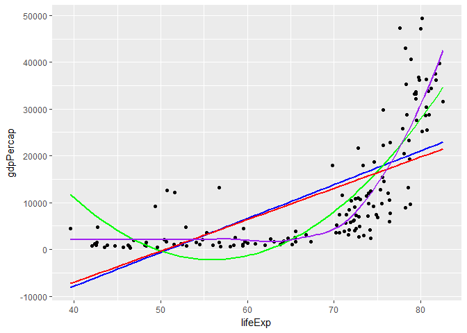

# STAT547M-hw06-An-Byeongchan


Pick (at least) two of the six (numbered) topics below and do one of the exercise prompts listed, or something comparable using your dataset of choice.

### 1. Character data

Read and work the exercises in the [Strings
chapter](http://r4ds.had.co.nz/strings.html) or R for Data Science.

```r
suppressPackageStartupMessages(library(tidyverse))
```

```
## Warning: package 'tidyverse' was built under R version 3.4.2
```

```r
suppressPackageStartupMessages(library(stringr))

#Practice
x <- "\"" # or '"'
writeLines(x)
```

```
## "
```

```r
x <- '\' \\' # or "'"
writeLines(x)
```

```
## ' \
```

```r
x <- "\u00b5"
writeLines(x)
```

```
## ¥ì
```

```r
#Combining strings 
str_c("Hi ", "How ", "are ", "you")
```

```
## [1] "Hi How are you"
```

```r
str_c("x", "y", sep = ", ")
```

```
## [1] "x, y"
```

```r
#str_c() is vectorized. 
str_c("prefix-", c("a", "b", "c"), "-suffix")
```

```
## [1] "prefix-a-suffix" "prefix-b-suffix" "prefix-c-suffix"
```

```r
#Load some tweets from the official Donald Trump account.
load(url("http://varianceexplained.org/files/trump_tweets_df.rda"))
tweets <- trump_tweets_df$text
tweets %>% head() %>% strtrim(70)
```

```
## [1] "My economic policy speech will be carried live at 12:15 P.M. Enjoy!"   
## [2] "Join me in Fayetteville, North Carolina tomorrow evening at 6pm. Ticke"
## [3] "#ICYMI: \"Will Media Apologize to Trump?\" https://t.co/ia7rKBmioA"    
## [4] "Michael Morell, the lightweight former Acting Director of C.I.A., and "
## [5] "The media is going crazy. They totally distort so many things on purpo"
## [6] "I see where Mayor Stephanie Rawlings-Blake of Baltimore is pushing Cro"
```

```r
regex <- "badly|crazy|weak|spent|strong|dumb|joke|guns|funny|dead"

tweets <- tweets[c(1, 2, 5, 6, 198, 347, 919)]
tweets %>% strtrim(70)
```

```
## [1] "My economic policy speech will be carried live at 12:15 P.M. Enjoy!"   
## [2] "Join me in Fayetteville, North Carolina tomorrow evening at 6pm. Ticke"
## [3] "The media is going crazy. They totally distort so many things on purpo"
## [4] "I see where Mayor Stephanie Rawlings-Blake of Baltimore is pushing Cro"
## [5] "Bernie Sanders started off strong, but with the selection of Kaine for"
## [6] "Crooked Hillary Clinton is unfit to serve as President of the U.S. Her"
## [7] "The Cruz-Kasich pact is under great strain. This joke of a deal is fal"
```

```r
matches <- gregexpr(regex, tweets)
matches
```

```
## [[1]]
## [1] -1
## attr(,"match.length")
## [1] -1
## attr(,"useBytes")
## [1] TRUE
## 
## [[2]]
## [1] -1
## attr(,"match.length")
## [1] -1
## attr(,"useBytes")
## [1] TRUE
## 
## [[3]]
## [1] 20
## attr(,"match.length")
## [1] 5
## attr(,"useBytes")
## [1] TRUE
## 
## [[4]]
## [1] 134
## attr(,"match.length")
## [1] 4
## attr(,"useBytes")
## [1] TRUE
## 
## [[5]]
## [1] 28 95
## attr(,"match.length")
## [1] 6 4
## attr(,"useBytes")
## [1] TRUE
## 
## [[6]]
## [1]  87 114
## attr(,"match.length")
## [1] 4 6
## attr(,"useBytes")
## [1] TRUE
## 
## [[7]]
## [1]  50 112 123
## attr(,"match.length")
## [1] 4 4 4
## attr(,"useBytes")
## [1] TRUE
```

```r
str(matches)
```

```
## List of 7
##  $ : atomic [1:1] -1
##   ..- attr(*, "match.length")= int -1
##   ..- attr(*, "useBytes")= logi TRUE
##  $ : atomic [1:1] -1
##   ..- attr(*, "match.length")= int -1
##   ..- attr(*, "useBytes")= logi TRUE
##  $ : atomic [1:1] 20
##   ..- attr(*, "match.length")= int 5
##   ..- attr(*, "useBytes")= logi TRUE
##  $ : atomic [1:1] 134
##   ..- attr(*, "match.length")= int 4
##   ..- attr(*, "useBytes")= logi TRUE
##  $ : atomic [1:2] 28 95
##   ..- attr(*, "match.length")= int [1:2] 6 4
##   ..- attr(*, "useBytes")= logi TRUE
##  $ : atomic [1:2] 87 114
##   ..- attr(*, "match.length")= int [1:2] 4 6
##   ..- attr(*, "useBytes")= logi TRUE
##  $ : atomic [1:3] 50 112 123
##   ..- attr(*, "match.length")= int [1:3] 4 4 4
##   ..- attr(*, "useBytes")= logi TRUE
```

```r
#View(matches)
lengths(matches) #lengths
```

```
## [1] 1 1 1 1 2 2 3
```

```r
map_int(matches, length)
```

```
## [1] 1 1 1 1 2 2 3
```

```r
## Exercise: Get a list of the match lengths
#Extracting attributes named `match.length()` from each element of the list `matches`
map(matches, function(x) attr(x, which = "match.length"))
```

```
## [[1]]
## [1] -1
## 
## [[2]]
## [1] -1
## 
## [[3]]
## [1] 5
## 
## [[4]]
## [1] 4
## 
## [[5]]
## [1] 6 4
## 
## [[6]]
## [1] 4 6
## 
## [[7]]
## [1] 4 4 4
```

```r
map(matches, ~attr(.x, which = "match.length"))
```

```
## [[1]]
## [1] -1
## 
## [[2]]
## [1] -1
## 
## [[3]]
## [1] 5
## 
## [[4]]
## [1] 4
## 
## [[5]]
## [1] 6 4
## 
## [[6]]
## [1] 4 6
## 
## [[7]]
## [1] 4 4 4
```

```r
#map(matches, ~ attr(.x, which = "match.length"))

## Exercise: Count the number of Trump Android words in each tweets.

# lengths() is for the lengths of the elements of `matches`
# This cannot distinguish between 0 and 1.
lengths(matches)
```

```
## [1] 1 1 1 1 2 2 3
```

```r
# Thus, apply `map_int()`!!
map_int(matches, function(x) sum(x>0))
```

```
## [1] 0 0 1 1 2 2 3
```

```r
# Removing attr for less clutter
# Using `as.vector()` to strip attributes.
match_vec <- map(matches, as.vector)
match_vec
```

```
## [[1]]
## [1] -1
## 
## [[2]]
## [1] -1
## 
## [[3]]
## [1] 20
## 
## [[4]]
## [1] 134
## 
## [[5]]
## [1] 28 95
## 
## [[6]]
## [1]  87 114
## 
## [[7]]
## [1]  50 112 123
```

```r
# Extracting exact words mentioned on the tweet
# What words are mentioned in tweet #7??
tweet_7 <- tweets[7]
match_first <- map(matches, as.vector)
match_length <- map(matches, function(x) attr(x, which = "match.length"))


(t_first <- match_first[[7]])
```

```
## [1]  50 112 123
```

```r
(t_length <- match_length[[7]])
```

```
## [1] 4 4 4
```

```r
(t_last <- match_first[[7]] + match_length[[7]] - 1)
```

```
## [1]  53 115 126
```

```r
substring(tweet_7, t_first, t_last)
```

```
## [1] "joke" "dead" "dumb"
```

```r
#Expand it to all the elements on the list.
match_last  <- map2(match_first, match_length, ~.x + .y -1) # 2 inputs

pmap(.l= list(text = tweets, first = match_first, last = match_last), substring) # 3 inputs
```

```
## [[1]]
## [1] ""
## 
## [[2]]
## [1] ""
## 
## [[3]]
## [1] "crazy"
## 
## [[4]]
## [1] "joke"
## 
## [[5]]
## [1] "strong" "weak"  
## 
## [[6]]
## [1] "weak"   "strong"
## 
## [[7]]
## [1] "joke" "dead" "dumb"
```

```r
#another way to do this
mdf <- tibble(
  text = tweets,
  first = match_first,
  last = match_last
)
pmap(mdf, substring)
```

```
## [[1]]
## [1] ""
## 
## [[2]]
## [1] ""
## 
## [[3]]
## [1] "crazy"
## 
## [[4]]
## [1] "joke"
## 
## [[5]]
## [1] "strong" "weak"  
## 
## [[6]]
## [1] "weak"   "strong"
## 
## [[7]]
## [1] "joke" "dead" "dumb"
```


## Steps to extract the words in a text
Pseudo-code
> text <- an element of a text
first <- an element of match_first
last <- an element of match_last
substring(text, first, last)


## Application to Finance
I tried to apply this skill to analyze the minutes of the FOMC (Federal Open Market Committee) meetings.   
  
I downloaded the data from https://stanford.edu/~rezab/useful/fomc_minutes.html 
  
Downloaded: 3 minutes (20010627, 20061025, 20071211)
Bag of words: inflation, investment, markets, economy, monetary, unemployment  

This is basic and introductory textual analysis to see if there is a change in the number of words mentioned during different periods (IT bubble, 2008 Financial Crisis)

```r
#m200106 <- scan("Data/20010627.txt", what="character", sep = NULL)

m200106 <- read_file("Data/20010627.txt")
m200610 <- read_file("Data/20061025.txt")
m200712 <- read_file("Data/20071211.txt")


bow <- "inflation|investment|markets|economy|monetary|unemployment"
collection  <-  list(m200106, m200610, m200712)
str(collection)
```

```
## List of 3
##  $ : chr "Minutes of the Federal Open Market Committee\r\nA meeting of the Federal Open Market Committee was held in the "| __truncated__
##  $ : chr "Minutes of the Federal Open Market Committee\r\n A meeting of the Federal Open Market Committee was held in the"| __truncated__
##  $ : chr "        BankingInformation&amp; Regulation\r\nMinutes of the Federal Open Market Committee\r\nA meeting of the "| __truncated__
```

```r
wrd_mtnd <- tibble(text = collection,
       first = gregexpr(bow, collection)) %>% 
  mutate (match_length = map(first, ~attr(.x, which = "match.length")),
          last = map2(first, match_length, ~ .x + .y -1)) %>% 
  select(-match_length) %>% 
  pmap(substring)
map(wrd_mtnd, ~table(.x)) 
```

```
## [[1]]
## .x
##      economy    inflation   investment      markets     monetary 
##           10           18            9           12           13 
## unemployment 
##            7 
## 
## [[2]]
## .x
##      economy    inflation   investment      markets     monetary 
##            5           40            6            3            4 
## unemployment 
##            1 
## 
## [[3]]
## .x
##      economy    inflation   investment      markets     monetary 
##            7           46           11           30            5 
## unemployment 
##            1
```


### 2. Writing functions

Pick one:

  * Write one (or more) functions that do something useful to pieces of the
Gapminder or Singer data. It is logical to think about computing on the mini-data frames
corresponding to the data for each specific country, location, year, band, album, ... This would pair well with
the prompt below about working with a nested data frame, as you could apply your
function there.
    - Make it something you can't easily do with built-in functions.
Make it something that's not trivial to do with the simple `dplyr` verbs. The
linear regression function [presented
here](block012_function-regress-lifeexp-on-year.html) is a good starting point.
You could generalize that to do quadratic regression (include a squared term) or
use robust regression, using `MASS::rlm()` or `robustbase::lmrob()`.

```r
suppressPackageStartupMessages(library(gapminder))
suppressPackageStartupMessages(library(tidyverse))
suppressPackageStartupMessages(library(MASS))

names(gapminder)
```

```
## [1] "country"   "continent" "year"      "lifeExp"   "pop"       "gdpPercap"
```

```r
#Cross-sectional data (lifeExp vs gdpPercap) in 2007
gap_2007 <- gapminder %>% 
  filter(year==2007) 
gap_2007 %>% 
  ggplot(aes(x=lifeExp, y=gdpPercap)) +
  geom_point() +
  geom_smooth(method = "lm", se=FALSE, color = "blue") +
  geom_smooth(method = "lm", se=FALSE, formula = y~poly(x,2), color= "green") +
  geom_smooth(method = "rlm", se=FALSE, color= "red") +
  geom_smooth(method = "auto", se=FALSE, color = "purple")
```

```
## `geom_smooth()` using method = 'loess'
```

<!-- -->

```r
lm(gdpPercap ~ lifeExp, gap_2007)
```

```
## 
## Call:
## lm(formula = gdpPercap ~ lifeExp, data = gap_2007)
## 
## Coefficients:
## (Intercept)      lifeExp  
##    -36759.4        722.9
```

```r
gap_2007_temp <- gap_2007 %>% 
  mutate(lifeExp2=  lifeExp^2)
lm(gdpPercap ~ lifeExp + lifeExp2, gap_2007_temp)
```

```
## 
## Call:
## lm(formula = gdpPercap ~ lifeExp + lifeExp2, data = gap_2007_temp)
## 
## Coefficients:
## (Intercept)      lifeExp     lifeExp2  
##   160672.71     -5821.05        52.01
```

```r
rlm(gdpPercap ~ lifeExp, gap_2007)
```

```
## Call:
## rlm(formula = gdpPercap ~ lifeExp, data = gap_2007)
## Converged in 7 iterations
## 
## Coefficients:
## (Intercept)     lifeExp 
## -33782.5152    669.1347 
## 
## Degrees of freedom: 142 total; 140 residual
## Scale estimate: 10000
```

```r
Reg_life_gdp<- function(mode, year){
  gap_year <- gapminder %>% 
    filter(year == year) %>% 
    mutate(lifeExp2 = lifeExp^2)
  if(mode=="lm"){
    the_fit <- lm(gdpPercap ~ lifeExp, gap_year)
    setNames(coef(the_fit), c("intercept", "slope"))
  }
  else if(mode=="qm"){
    the_fit <- lm(gdpPercap ~ lifeExp + lifeExp2, gap_year)
    setNames(coef(the_fit), c("intercept", "slope1", "slope2"))
  }
  else if(mode=="rlm"){
    the_fit <- rlm(gdpPercap ~ lifeExp, gap_year)
    setNames(coef(the_fit), c("intercept", "slope1"))    
  }
}

Reg_life_gdp("lm", 2002)
```

```
##   intercept       slope 
## -19277.2490    445.4447
```

```r
Reg_life_gdp("rlm", 2007)
```

```
##   intercept      slope1 
## -14275.8026    338.0108
```


  * If you plan to complete the homework where we build an R package, write a couple of experimental functions exploring some functionality that is useful to you in real life and that might form the basis of your personal package.

### 3. Work with the candy data

In 2015, we explored a dataset based on a Halloween candy survey (but it included many other odd and interesting questions). Work on something from [this homework from 2015](hw07_2015_data-wrangling-candy.html). It is good practice on basic
data ingest, exploration, character data cleanup, and wrangling.

### 4. Work with the `singer` data

The `singer_location` dataframe in the `singer` package contains geographical information stored in two different formats: 1. as a (dirty!) variable named `city`; 2. as a latitude / longitude pair (stored in `latitude`, `longitude` respectively). The function `revgeocode` from the `ggmap` library allows you to retrieve some information for a pair (vector) of longitude, latitude (warning: notice the order in which you need to pass lat and long). Read its manual page.

```r
suppressPackageStartupMessages(library(singer))
suppressPackageStartupMessages(library(tidyverse))
#install.packages('ggmap')
suppressPackageStartupMessages(library(ggmap))
```

```
## Warning: package 'ggmap' was built under R version 3.4.2
```

```r
#View(singer_locations)
```

1. Use `purrr` to map latitude and longitude into human readable information on the band's origin places. Notice that `revgeocode(... , output = "more")` outputs a dataframe, while `revgeocode(... , output = "address")` returns a string: you have the option of dealing with nested dataframes.  
You will need to pay attention to two things:  
    *  Not all of the track have a latitude and longitude: what can we do with the missing information? (_filtering_, ...)
    *  Not all of the time we make a research through `revgeocode()` we get a result. What can we do to avoid those errors to bite us? (look at _possibly()_ in `purrr`...)

```r
View(singer_locations)
#singer_locations %>% 
#  mutate(test = paste("latitude, longitude, collapse = " ,"))
```


2. Try to check wether the place in `city` corresponds to the information you retrieved.

3. If you still have time, you can go visual: give a look to the library [`leaflet`](https://rstudio.github.io/leaflet) and plot some information about the bands. A snippet of code is provided below.  
```r
singer_locations %>%  
  leaflet()  %>%   
  addTiles() %>%  
  addCircles(popup = ~artist_name)
```

### 5. Work with a list

Work through and write up a lesson from the [purrr
tutorial](https://jennybc.github.io/purrr-tutorial/index.html):

  * [Trump Android
Tweets](https://jennybc.github.io/purrr-tutorial/ls08_trump-tweets.html)
  * [Simplifying data from a list of GitHub
users](https://jennybc.github.io/purrr-tutorial/ls02_map-extraction-advanced.html)

### 6. Work with a nested data frame

Create a nested data frame and map a function over the list column holding the
nested data. Use list extraction or other functions to pull interesting
information out of these results and work your way back to a simple data frame
you can visualize and explore.

Here's a fully developed prompt for Gapminder:

  * See the [split-apply-combine lesson from
class](block024_group-nest-split-map.html)
  * Nest the data by country (and continent).
  * Fit a model of life expectancy against year. Possibly quadratic,
possibly robust (see above prompt re: function writing).
  * Use functions for working with fitted models or the [broom
package](https://github.com/tidyverse/broom) to get information out of your
linear models.
  * Use the usual dplyr, tidyr, and ggplot2 workflows to explore,
e.g., the estimated cofficients.

Inspiration for the modelling and downstream inspiration

  * Find countries with interesting stories. - Sudden, substantial departures from the temporal trend is interesting. How could you operationalize this notion of "interesting"?
  * Use the residuals to detect countries where your model is a
terrible fit. Examples: Are there are 1 or more freakishly large residuals, in
an absolute sense or relative to some estimate of background variability? Are
there strong patterns in the sign of the residuals? E.g., all pos, then all neg,
then pos again.
  * Fit a regression using ordinary least squares and a robust
technique. Determine the difference in estimated parameters under the two
approaches. If it is large, consider that country "interesting".
  * Compare a linear and quadratic fit

