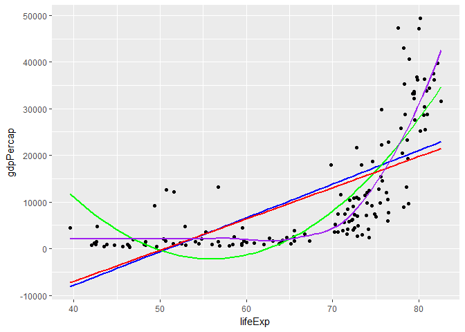

# STAT547M-hw06-An-Byeongchan


Pick (at least) two of the six (numbered) topics below and do one of the exercise prompts listed, or something comparable using your dataset of choice.

 - I chose Q2, Q4, Q5. 

### 5. Work with a list
`purrr`'s map function is useful to get information out of a non-rectangular data structure.  
The `map` functions transform their input by applying a function to **each element** and returning a vector the same length as the input.  
- `map()`, `map2()`, `pmap()` return a list.
- `map_lgl()`, `map_int()`, `map_chr()` return vectors of the corresponding type.  


## Trump Android words
This is a text analysis of Trump's tweets. 

```r
suppressPackageStartupMessages(library(tidyverse))
```

```
## Warning: package 'tidyverse' was built under R version 3.4.2
```

```r
suppressPackageStartupMessages(library(purrr))


#Load some tweets from the official Donald Trump account.
load(url("http://varianceexplained.org/files/trump_tweets_df.rda"))
tweets <- trump_tweets_df$text
tweets %>% head() %>% strtrim(70)
```

```
## [1] "My economic policy speech will be carried live at 12:15 P.M. Enjoy!"   
## [2] "Join me in Fayetteville, North Carolina tomorrow evening at 6pm. Ticke"
## [3] "#ICYMI: \"Will Media Apologize to Trump?\" https://t.co/ia7rKBmioA"    
## [4] "Michael Morell, the lightweight former Acting Director of C.I.A., and "
## [5] "The media is going crazy. They totally distort so many things on purpo"
## [6] "I see where Mayor Stephanie Rawlings-Blake of Baltimore is pushing Cro"
```

```r
#Some words that were shown to be associated with Trump tweets.
regex <- "badly|crazy|weak|spent|strong|dumb|joke|guns|funny|dead"

#Select some tweets.
tweets <- tweets[c(1, 2, 5, 6, 198, 347, 919)]
tweets %>% strtrim(70)
```

```
## [1] "My economic policy speech will be carried live at 12:15 P.M. Enjoy!"   
## [2] "Join me in Fayetteville, North Carolina tomorrow evening at 6pm. Ticke"
## [3] "The media is going crazy. They totally distort so many things on purpo"
## [4] "I see where Mayor Stephanie Rawlings-Blake of Baltimore is pushing Cro"
## [5] "Bernie Sanders started off strong, but with the selection of Kaine for"
## [6] "Crooked Hillary Clinton is unfit to serve as President of the U.S. Her"
## [7] "The Cruz-Kasich pact is under great strain. This joke of a deal is fal"
```

With the selected tweets, I will investigate which words in the bag of words are mentioned in each tweet. `substring(text, first, last)` is one way to solve this. We need each words first position and last position. `gregexpr()` function can be used to extract the positions.  
`map` functions will be used to apply this to each tweet in a list.  


```r
#Extract the information of the words in each tweet. Output is a list
#First position and length!
matches <- gregexpr(regex, tweets)
matches
```

```
## [[1]]
## [1] -1
## attr(,"match.length")
## [1] -1
## attr(,"useBytes")
## [1] TRUE
## 
## [[2]]
## [1] -1
## attr(,"match.length")
## [1] -1
## attr(,"useBytes")
## [1] TRUE
## 
## [[3]]
## [1] 20
## attr(,"match.length")
## [1] 5
## attr(,"useBytes")
## [1] TRUE
## 
## [[4]]
## [1] 134
## attr(,"match.length")
## [1] 4
## attr(,"useBytes")
## [1] TRUE
## 
## [[5]]
## [1] 28 95
## attr(,"match.length")
## [1] 6 4
## attr(,"useBytes")
## [1] TRUE
## 
## [[6]]
## [1]  87 114
## attr(,"match.length")
## [1] 4 6
## attr(,"useBytes")
## [1] TRUE
## 
## [[7]]
## [1]  50 112 123
## attr(,"match.length")
## [1] 4 4 4
## attr(,"useBytes")
## [1] TRUE
```

```r
str(matches)
```

```
## List of 7
##  $ : atomic [1:1] -1
##   ..- attr(*, "match.length")= int -1
##   ..- attr(*, "useBytes")= logi TRUE
##  $ : atomic [1:1] -1
##   ..- attr(*, "match.length")= int -1
##   ..- attr(*, "useBytes")= logi TRUE
##  $ : atomic [1:1] 20
##   ..- attr(*, "match.length")= int 5
##   ..- attr(*, "useBytes")= logi TRUE
##  $ : atomic [1:1] 134
##   ..- attr(*, "match.length")= int 4
##   ..- attr(*, "useBytes")= logi TRUE
##  $ : atomic [1:2] 28 95
##   ..- attr(*, "match.length")= int [1:2] 6 4
##   ..- attr(*, "useBytes")= logi TRUE
##  $ : atomic [1:2] 87 114
##   ..- attr(*, "match.length")= int [1:2] 4 6
##   ..- attr(*, "useBytes")= logi TRUE
##  $ : atomic [1:3] 50 112 123
##   ..- attr(*, "match.length")= int [1:3] 4 4 4
##   ..- attr(*, "useBytes")= logi TRUE
```

```r
#View(matches)


## Exercise: Get a list of the match lengths. This is for the last position of each word. 
#Extracting attributes named `match.length()` from each element of the list `matches`
map(matches, function(x) attr(x, which = "match.length"))
```

```
## [[1]]
## [1] -1
## 
## [[2]]
## [1] -1
## 
## [[3]]
## [1] 5
## 
## [[4]]
## [1] 4
## 
## [[5]]
## [1] 6 4
## 
## [[6]]
## [1] 4 6
## 
## [[7]]
## [1] 4 4 4
```

```r
#map(matches, ~ attr(.x, which = "match.length"))


## Exercise: Count the number of Trump Android words in each tweets.

# lengths() is for the length of each element of `matches`
#`map_int()` is another way to do it.
# BUT these cannot distinguish between 0 and 1.
lengths(matches)
```

```
## [1] 1 1 1 1 2 2 3
```

```r
map_int(matches, length)
```

```
## [1] 1 1 1 1 2 2 3
```

```r
# Thus, apply `map_int()` and modify it!!
map_int(matches, function(x) sum(x>0))
```

```
## [1] 0 0 1 1 2 2 3
```

```r
# Removing attr for less clutter
# Using `as.vector()` to strip attributes.
match_vec <- map(matches, as.vector)
match_vec
```

```
## [[1]]
## [1] -1
## 
## [[2]]
## [1] -1
## 
## [[3]]
## [1] 20
## 
## [[4]]
## [1] 134
## 
## [[5]]
## [1] 28 95
## 
## [[6]]
## [1]  87 114
## 
## [[7]]
## [1]  50 112 123
```

```r
## Extracting exact words mentioned on the tweet
# What words are mentioned in tweet #7??
tweet_7 <- tweets[7]
match_first <- map(matches, as.vector)
match_length <- map(matches, function(x) attr(x, which = "match.length"))

#The first position of each word in tweet #7
(t_first <- match_first[[7]])
```

```
## [1]  50 112 123
```

```r
#The length of each word in tweet #7
(t_length <- match_length[[7]])
```

```
## [1] 4 4 4
```

```r
#Then, we can extract the last position of each word.
(t_last <- match_first[[7]] + match_length[[7]] - 1)
```

```
## [1]  53 115 126
```

```r
#The words mentioned in tweet #7
substring(tweet_7, t_first, t_last)
```

```
## [1] "joke" "dead" "dumb"
```

```r
#Expand it to all the tweets.
#Extracting last positions.
match_last  <- map2(match_first, match_length, ~.x + .y -1) # 2 inputs

#Using `pmap()` we can extract the words mentioned in each tweet.
#`pmap()` takes a list as an input.
pmap(.l= list(text = tweets, first = match_first, last = match_last), substring) 
```

```
## [[1]]
## [1] ""
## 
## [[2]]
## [1] ""
## 
## [[3]]
## [1] "crazy"
## 
## [[4]]
## [1] "joke"
## 
## [[5]]
## [1] "strong" "weak"  
## 
## [[6]]
## [1] "weak"   "strong"
## 
## [[7]]
## [1] "joke" "dead" "dumb"
```

```r
#another way to do this
mdf <- tibble(
  text = tweets,
  first = match_first,
  last = match_last
)
pmap(mdf, substring)
```

```
## [[1]]
## [1] ""
## 
## [[2]]
## [1] ""
## 
## [[3]]
## [1] "crazy"
## 
## [[4]]
## [1] "joke"
## 
## [[5]]
## [1] "strong" "weak"  
## 
## [[6]]
## [1] "weak"   "strong"
## 
## [[7]]
## [1] "joke" "dead" "dumb"
```


## Steps to extract the words in a text
Pseudo-code
> text <- an element of a text  
> first <- an element of match_first  
> last <- an element of match_last  
> substring(text, first, last)  


## Application to Finance
I tried to apply this skill to analyze the minutes of the FOMC (Federal Open Market Committee) meetings.   
  
I downloaded the data from https://stanford.edu/~rezab/useful/fomc_minutes.html 
  
Downloaded: 3 minutes (20010627, 20061025, 20071211)  
Bag of words: inflation, investment, markets, economy, monetary, unemployment  

This is basic and introductory textual analysis to see if there is a change in the number of words mentioned during different periods (IT bubble, 2008 Financial Crisis)

```r
## Read the data and make them ready.
#m200106 <- scan("Data/20010627.txt", what="character", sep = NULL)
m200106 <- read_file("Data/20010627.txt")
m200610 <- read_file("Data/20061025.txt")
m200712 <- read_file("Data/20071211.txt")

#Bag of words
bow <- "inflation|investment|markets|economy|monetary|unemployment"
collection  <-  list(m200106, m200610, m200712)
str(collection)
```

```
## List of 3
##  $ : chr "Minutes of the Federal Open Market Committee\r\nA meeting of the Federal Open Market Committee was held in the "| __truncated__
##  $ : chr "Minutes of the Federal Open Market Committee\r\n A meeting of the Federal Open Market Committee was held in the"| __truncated__
##  $ : chr "        BankingInformation&amp; Regulation\r\nMinutes of the Federal Open Market Committee\r\nA meeting of the "| __truncated__
```

```r
#Extracting all the words mentioned in each minute. 
wrd_mtnd <- tibble(text = collection,
       first = gregexpr(bow, collection)) %>% 
  mutate (match_length = map(first, ~attr(.x, which = "match.length")),
          last = map2(first, match_length, ~ .x + .y -1)) %>% 
  select(-match_length) %>% 
  pmap(substring)
map(wrd_mtnd, ~table(.x)) 
```

```
## [[1]]
## .x
##      economy    inflation   investment      markets     monetary 
##           10           18            9           12           13 
## unemployment 
##            7 
## 
## [[2]]
## .x
##      economy    inflation   investment      markets     monetary 
##            5           40            6            3            4 
## unemployment 
##            1 
## 
## [[3]]
## .x
##      economy    inflation   investment      markets     monetary 
##            7           46           11           30            5 
## unemployment 
##            1
```


### 2. Writing functions

I made a function `Reg_life_gdp(mode, year)` which can do a regression in a specific year with cross-sectional data (lifeExp vs. gdpPercap; Regress gdpPercap on lifeExp). There are three different modes; Linear model, Quadratic model, and Robust model.  


```r
suppressPackageStartupMessages(library(gapminder))
suppressPackageStartupMessages(library(tidyverse))
suppressPackageStartupMessages(library(MASS))

names(gapminder)
```

```
## [1] "country"   "continent" "year"      "lifeExp"   "pop"       "gdpPercap"
```

```r
#Cross-sectional data (lifeExp vs gdpPercap) in 2007
gap_2007 <- gapminder %>% 
  filter(year==2007) 


#Try to do some regressions such as linear model, quadratic model, robust model
gap_2007 %>% 
  ggplot(aes(x=lifeExp, y=gdpPercap)) +
  geom_point() +
  geom_smooth(method = "lm", se=FALSE, color = "blue") +
  geom_smooth(method = "lm", se=FALSE, formula = y~poly(x,2), color= "green") +
  geom_smooth(method = "rlm", se=FALSE, color= "red") +
  geom_smooth(method = "auto", se=FALSE, color = "purple")
```

```
## `geom_smooth()` using method = 'loess'
```

<!-- -->

```r
#Try to get some coefficients using each regression methods
lm(gdpPercap ~ lifeExp, gap_2007)
```

```
## 
## Call:
## lm(formula = gdpPercap ~ lifeExp, data = gap_2007)
## 
## Coefficients:
## (Intercept)      lifeExp  
##    -36759.4        722.9
```

```r
gap_2007_temp <- gap_2007 %>% 
  mutate(lifeExp2=  lifeExp^2)
lm(gdpPercap ~ lifeExp + lifeExp2, gap_2007_temp)
```

```
## 
## Call:
## lm(formula = gdpPercap ~ lifeExp + lifeExp2, data = gap_2007_temp)
## 
## Coefficients:
## (Intercept)      lifeExp     lifeExp2  
##   160672.71     -5821.05        52.01
```

```r
rlm(gdpPercap ~ lifeExp, gap_2007)
```

```
## Call:
## rlm(formula = gdpPercap ~ lifeExp, data = gap_2007)
## Converged in 7 iterations
## 
## Coefficients:
## (Intercept)     lifeExp 
## -33782.5152    669.1347 
## 
## Degrees of freedom: 142 total; 140 residual
## Scale estimate: 10000
```

```r
#Generalize (make a function) to take mode and year as inputs.
Reg_life_gdp<- function(mode, year){
  gap_year <- gapminder %>% 
    filter(year == year) %>% 
    mutate(lifeExp2 = lifeExp^2)
  if(mode=="lm"){
    the_fit <- lm(gdpPercap ~ lifeExp, gap_year)
    setNames(coef(the_fit), c("intercept", "slope"))
  }
  else if(mode=="qm"){
    the_fit <- lm(gdpPercap ~ lifeExp + lifeExp2, gap_year)
    setNames(coef(the_fit), c("intercept", "slope1", "slope2"))
  }
  else if(mode=="rlm"){
    the_fit <- rlm(gdpPercap ~ lifeExp, gap_year)
    setNames(coef(the_fit), c("intercept", "slope1"))    
  }
}

#Some examples
Reg_life_gdp("lm", 2002)
```

```
##   intercept       slope 
## -19277.2490    445.4447
```

```r
Reg_life_gdp("rlm", 2007)
```

```
##   intercept      slope1 
## -14275.8026    338.0108
```


### 4. Work with the `singer` data

The `singer_location` dataframe in the `singer` package contains geographical information stored in two different formats: 1. as a (dirty!) variable named `city`; 2. as a latitude / longitude pair (stored in `latitude`, `longitude` respectively). The function `revgeocode` from the `ggmap` library allows you to retrieve some information for a pair (vector) of longitude, latitude (warning: notice the order in which you need to pass lat and long). Read its manual page.

```r
suppressPackageStartupMessages(library(singer))
suppressPackageStartupMessages(library(stringr))
suppressPackageStartupMessages(library(tidyverse))
#install.packages('ggmap')
suppressPackageStartupMessages(library(ggmap))
```

```
## Warning: package 'ggmap' was built under R version 3.4.2
```

```r
#View(singer_locations)
```

1. Use `purrr` to map latitude and longitude into human readable information on the band's origin places. Notice that `revgeocode(... , output = "more")` outputs a dataframe, while `revgeocode(... , output = "address")` returns a string: you have the option of dealing with nested dataframes.  
You will need to pay attention to two things:  
    *  Not all of the track have a latitude and longitude: what can we do with the missing information? (_filtering_, ...)
    *  Not all of the time we make a research through `revgeocode()` we get a result. What can we do to avoid those errors to bite us? (look at _possibly()_ in `purrr`...)  
    
Human readable information on the band's origin places is extracted through `revgeocode()`. When `revgeocode()` is used, all the observations with NA should be removed. I used `filter()` to solve this.

```r
glimpse(singer_locations)
```

```
## Observations: 10,100
## Variables: 14
## $ track_id           <chr> "TRWICRA128F42368DB", "TRXJANY128F42246FC",...
## $ title              <chr> "The Conversation (Cd)", "Lonely Island", "...
## $ song_id            <chr> "SOSURTI12A81C22FB8", "SODESQP12A6D4F98EF",...
## $ release            <chr> "Even If It Kills Me", "The Duke Of Earl", ...
## $ artist_id          <chr> "ARACDPV1187FB58DF4", "ARYBUAO1187FB3F4EB",...
## $ artist_name        <chr> "Motion City Soundtrack", "Gene Chandler", ...
## $ year               <int> 2007, 2004, 1998, 1995, 1968, 2006, 2003, 2...
## $ duration           <dbl> 170.4485, 106.5530, 527.5947, 695.1179, 237...
## $ artist_hotttnesss  <dbl> 0.6410183, 0.3937627, 0.4306226, 0.3622792,...
## $ artist_familiarity <dbl> 0.8230522, 0.5700167, 0.5039940, 0.4773099,...
## $ latitude           <dbl> NA, 41.88415, 40.71455, NA, 42.33168, 40.99...
## $ longitude          <dbl> NA, -87.63241, -74.00712, NA, -83.04792, -7...
## $ name               <chr> NA, "Gene Chandler", "Paul Horn", NA, "Doro...
## $ city               <chr> NA, "Chicago, IL", "New York, NY", NA, "Det...
```

```r
#It takes so long time that I just try it with some observations.
singer_loc <- singer_locations %>% 
  filter(!is.na(longitude|latitude)) %>% 
  head() %>% 
  mutate(loc = map2(longitude, latitude, ~ revgeocode(c(.x, .y), output = "address")))
```

```
## Information from URL : http://maps.googleapis.com/maps/api/geocode/json?latlng=41.88415,-87.63241&sensor=false
```

```
## Information from URL : http://maps.googleapis.com/maps/api/geocode/json?latlng=40.71455,-74.00712&sensor=false
```

```
## Information from URL : http://maps.googleapis.com/maps/api/geocode/json?latlng=42.33168,-83.04792&sensor=false
```

```
## Information from URL : http://maps.googleapis.com/maps/api/geocode/json?latlng=40.99471,-77.60454&sensor=false
```

```
## Information from URL : http://maps.googleapis.com/maps/api/geocode/json?latlng=34.20034,-119.18044&sensor=false
```

```
## Information from URL : http://maps.googleapis.com/maps/api/geocode/json?latlng=50.7323,7.10169&sensor=false
```

```r
unnest(singer_loc)
```

```
## # A tibble: 6 x 15
##             track_id                 title            song_id
##                <chr>                 <chr>              <chr>
## 1 TRXJANY128F42246FC         Lonely Island SODESQP12A6D4F98EF
## 2 TRIKPCA128F424A553 Here's That Rainy Day SOQUYQD12A8C131619
## 3 TRBYYXH128F4264585                 Games SOPIOCP12A8C13A322
## 4 TRKFFKR128F9303AE3            More Pipes SOHQSPY12AB0181325
## 5 TRWKTVW12903CE5ACF           Indian Deli SOGYBYQ12AB0188586
## 6 TRUWFXF128E0795D22         Miss Gorgeous SOTEIQB12A6702048D
## # ... with 12 more variables: release <chr>, artist_id <chr>,
## #   artist_name <chr>, year <int>, duration <dbl>,
## #   artist_hotttnesss <dbl>, artist_familiarity <dbl>, latitude <dbl>,
## #   longitude <dbl>, name <chr>, city <chr>, loc <chr>
```
I tried to use `possibly()` to avoid generating side effects. The result using `singer_locations` is same, but when the input is not proper, this function returns "Not proper inputs". Thus, it is possible to use observations without longitude, latitude information (Output would be "Not proper inputs"). I don't need to use `filter` to remove all the observations with `NA`.

```r
#A new function `revgeocode2()` using `possibly()`
revgeocode2 <- possibly(~ revgeocode(c(.x, .y), output = "address"), 
                        otherwise = "*****Not proper inputs*****")
#Same result as using `revgeocode()`
singer_loc2 <- singer_locations %>% 
  filter(!is.na(longitude|latitude)) %>% 
  head() %>% 
  mutate(loc = map2(longitude, latitude,
                    ~ revgeocode2(.x, .y)))
```

```
## Information from URL : http://maps.googleapis.com/maps/api/geocode/json?latlng=41.88415,-87.63241&sensor=false
```

```
## Information from URL : http://maps.googleapis.com/maps/api/geocode/json?latlng=40.71455,-74.00712&sensor=false
```

```
## Information from URL : http://maps.googleapis.com/maps/api/geocode/json?latlng=42.33168,-83.04792&sensor=false
```

```
## Information from URL : http://maps.googleapis.com/maps/api/geocode/json?latlng=40.99471,-77.60454&sensor=false
```

```
## .Information from URL : http://maps.googleapis.com/maps/api/geocode/json?latlng=34.20034,-119.18044&sensor=false
## .Information from URL : http://maps.googleapis.com/maps/api/geocode/json?latlng=50.7323,7.10169&sensor=false
```

```r
unnest(singer_loc2)
```

```
## # A tibble: 6 x 15
##             track_id                 title            song_id
##                <chr>                 <chr>              <chr>
## 1 TRXJANY128F42246FC         Lonely Island SODESQP12A6D4F98EF
## 2 TRIKPCA128F424A553 Here's That Rainy Day SOQUYQD12A8C131619
## 3 TRBYYXH128F4264585                 Games SOPIOCP12A8C13A322
## 4 TRKFFKR128F9303AE3            More Pipes SOHQSPY12AB0181325
## 5 TRWKTVW12903CE5ACF           Indian Deli SOGYBYQ12AB0188586
## 6 TRUWFXF128E0795D22         Miss Gorgeous SOTEIQB12A6702048D
## # ... with 12 more variables: release <chr>, artist_id <chr>,
## #   artist_name <chr>, year <int>, duration <dbl>,
## #   artist_hotttnesss <dbl>, artist_familiarity <dbl>, latitude <dbl>,
## #   longitude <dbl>, name <chr>, city <chr>, loc <chr>
```

```r
##When the observations with NA are included, still it is possible to use the function `revgeocode2()`. The output for those observations are "Not proper inputs"
singer_loc3 <- singer_locations %>% 
  head() %>% 
  mutate(loc= map2(longitude, latitude,
                   ~ revgeocode2(.x, .y)))
```

```
## .
```

```
## Warning in readLines(connect): cannot open URL 'http://maps.googleapis.com/
## maps/api/geocode/json?latlng=NA,NA&sensor=false': HTTP status was '400 Bad
## Request'
```

```
## .Information from URL : http://maps.googleapis.com/maps/api/geocode/json?latlng=41.88415,-87.63241&sensor=false
## .Information from URL : http://maps.googleapis.com/maps/api/geocode/json?latlng=40.71455,-74.00712&sensor=false
## .
```

```
## Warning in readLines(connect): cannot open URL 'http://maps.googleapis.com/
## maps/api/geocode/json?latlng=NA,NA&sensor=false': HTTP status was '400 Bad
## Request'
```

```
## .Information from URL : http://maps.googleapis.com/maps/api/geocode/json?latlng=42.33168,-83.04792&sensor=false
## .Information from URL : http://maps.googleapis.com/maps/api/geocode/json?latlng=40.99471,-77.60454&sensor=false
```

```r
unnest(singer_loc3)
```

```
## # A tibble: 6 x 15
##             track_id                 title            song_id
##                <chr>                 <chr>              <chr>
## 1 TRWICRA128F42368DB The Conversation (Cd) SOSURTI12A81C22FB8
## 2 TRXJANY128F42246FC         Lonely Island SODESQP12A6D4F98EF
## 3 TRIKPCA128F424A553 Here's That Rainy Day SOQUYQD12A8C131619
## 4 TRYEATD128F92F87C9       Rego Park Blues SOEZGRC12AB017F1AC
## 5 TRBYYXH128F4264585                 Games SOPIOCP12A8C13A322
## 6 TRKFFKR128F9303AE3            More Pipes SOHQSPY12AB0181325
## # ... with 12 more variables: release <chr>, artist_id <chr>,
## #   artist_name <chr>, year <int>, duration <dbl>,
## #   artist_hotttnesss <dbl>, artist_familiarity <dbl>, latitude <dbl>,
## #   longitude <dbl>, name <chr>, city <chr>, loc <chr>
```

```r
#When the input is c(NA, NA)
revgeocode2(NA, NA)
```

```
## [1] "*****Not proper inputs*****"
```


2. Try to check wether the place in `city` corresponds to the information you retrieved.   
I tried to use `output = "more"` in `revgeocode()` to extract each element in address information. Information in `singer_loc4$city` contains only `city`, only `state`, or `city` with `state`. I tried to compare both. But the problem I got in was when I extract each element in address information using `output = "more"`, it returns full name of states. What I wanted was state abbreviations for comparing with `singer_loc4$city` (when `output = "address"` is used, the state names are in abbreviations.). I fixed this with `state.abb[grep(.x, state.name)]`. Then, the place in `city` corresponds to the information I retrieved.

```r
singer_loc4 <- singer_locations %>% 
  filter(!is.na(longitude|latitude)) %>% 
  head() %>% 
  mutate(loc = map2(longitude, 
                    latitude, 
                    ~ revgeocode(c(.x, .y), output = "more"))) %>% 
  unnest()
```

```
## Information from URL : http://maps.googleapis.com/maps/api/geocode/json?latlng=41.88415,-87.63241&sensor=false
```

```
## Information from URL : http://maps.googleapis.com/maps/api/geocode/json?latlng=40.71455,-74.00712&sensor=false
```

```
## .Information from URL : http://maps.googleapis.com/maps/api/geocode/json?latlng=42.33168,-83.04792&sensor=false
```

```
## Warning in if (anyNA(opts))
## stop(sprintf(ngettext(as.integer(sum(is.na(opts))), : closing unused
## connection 7 (http://maps.googleapis.com/maps/api/geocode/json?
## latlng=NA,NA&sensor=false)
```

```
## Warning in if (anyNA(opts))
## stop(sprintf(ngettext(as.integer(sum(is.na(opts))), : closing unused
## connection 6 (http://maps.googleapis.com/maps/api/geocode/json?
## latlng=NA,NA&sensor=false)
```

```
## .Information from URL : http://maps.googleapis.com/maps/api/geocode/json?latlng=40.99471,-77.60454&sensor=false
## .Information from URL : http://maps.googleapis.com/maps/api/geocode/json?latlng=34.20034,-119.18044&sensor=false
## .Information from URL : http://maps.googleapis.com/maps/api/geocode/json?latlng=50.7323,7.10169&sensor=false
```

```
## Warning in bind_rows_(x, .id): Unequal factor levels: coercing to character
```

```
## Warning in bind_rows_(x, .id): binding character and factor vector,
## coercing into character vector

## Warning in bind_rows_(x, .id): binding character and factor vector,
## coercing into character vector
```

```
## Warning in bind_rows_(x, .id): Unequal factor levels: coercing to character
```

```
## Warning in bind_rows_(x, .id): binding character and factor vector,
## coercing into character vector

## Warning in bind_rows_(x, .id): binding character and factor vector,
## coercing into character vector
```

```
## Warning in bind_rows_(x, .id): Unequal factor levels: coercing to character
```

```
## Warning in bind_rows_(x, .id): binding character and factor vector,
## coercing into character vector

## Warning in bind_rows_(x, .id): binding character and factor vector,
## coercing into character vector
```

```
## Warning in bind_rows_(x, .id): Unequal factor levels: coercing to character
```

```
## Warning in bind_rows_(x, .id): binding character and factor vector,
## coercing into character vector

## Warning in bind_rows_(x, .id): binding character and factor vector,
## coercing into character vector
```

```
## Warning in bind_rows_(x, .id): Unequal factor levels: coercing to character
```

```
## Warning in bind_rows_(x, .id): binding character and factor vector,
## coercing into character vector

## Warning in bind_rows_(x, .id): binding character and factor vector,
## coercing into character vector
```

```
## Warning in bind_rows_(x, .id): Unequal factor levels: coercing to character
```

```
## Warning in bind_rows_(x, .id): binding character and factor vector,
## coercing into character vector

## Warning in bind_rows_(x, .id): binding character and factor vector,
## coercing into character vector
```

```
## Warning in bind_rows_(x, .id): Unequal factor levels: coercing to character
```

```
## Warning in bind_rows_(x, .id): binding character and factor vector,
## coercing into character vector

## Warning in bind_rows_(x, .id): binding character and factor vector,
## coercing into character vector
```

```
## Warning in bind_rows_(x, .id): Unequal factor levels: coercing to character
```

```
## Warning in bind_rows_(x, .id): binding character and factor vector,
## coercing into character vector

## Warning in bind_rows_(x, .id): binding character and factor vector,
## coercing into character vector

## Warning in bind_rows_(x, .id): binding character and factor vector,
## coercing into character vector

## Warning in bind_rows_(x, .id): binding character and factor vector,
## coercing into character vector

## Warning in bind_rows_(x, .id): binding character and factor vector,
## coercing into character vector

## Warning in bind_rows_(x, .id): binding character and factor vector,
## coercing into character vector

## Warning in bind_rows_(x, .id): binding character and factor vector,
## coercing into character vector

## Warning in bind_rows_(x, .id): binding character and factor vector,
## coercing into character vector

## Warning in bind_rows_(x, .id): binding character and factor vector,
## coercing into character vector

## Warning in bind_rows_(x, .id): binding character and factor vector,
## coercing into character vector

## Warning in bind_rows_(x, .id): binding character and factor vector,
## coercing into character vector

## Warning in bind_rows_(x, .id): binding character and factor vector,
## coercing into character vector

## Warning in bind_rows_(x, .id): binding character and factor vector,
## coercing into character vector

## Warning in bind_rows_(x, .id): binding character and factor vector,
## coercing into character vector

## Warning in bind_rows_(x, .id): binding character and factor vector,
## coercing into character vector

## Warning in bind_rows_(x, .id): binding character and factor vector,
## coercing into character vector

## Warning in bind_rows_(x, .id): binding character and factor vector,
## coercing into character vector

## Warning in bind_rows_(x, .id): binding character and factor vector,
## coercing into character vector

## Warning in bind_rows_(x, .id): binding character and factor vector,
## coercing into character vector

## Warning in bind_rows_(x, .id): binding character and factor vector,
## coercing into character vector

## Warning in bind_rows_(x, .id): binding character and factor vector,
## coercing into character vector

## Warning in bind_rows_(x, .id): binding character and factor vector,
## coercing into character vector

## Warning in bind_rows_(x, .id): binding character and factor vector,
## coercing into character vector

## Warning in bind_rows_(x, .id): binding character and factor vector,
## coercing into character vector

## Warning in bind_rows_(x, .id): binding character and factor vector,
## coercing into character vector

## Warning in bind_rows_(x, .id): binding character and factor vector,
## coercing into character vector

## Warning in bind_rows_(x, .id): binding character and factor vector,
## coercing into character vector

## Warning in bind_rows_(x, .id): binding character and factor vector,
## coercing into character vector

## Warning in bind_rows_(x, .id): binding character and factor vector,
## coercing into character vector

## Warning in bind_rows_(x, .id): binding character and factor vector,
## coercing into character vector

## Warning in bind_rows_(x, .id): binding character and factor vector,
## coercing into character vector
```

```
## Warning in bind_rows_(x, .id): Unequal factor levels: coercing to character
```

```
## Warning in bind_rows_(x, .id): binding character and factor vector,
## coercing into character vector

## Warning in bind_rows_(x, .id): binding character and factor vector,
## coercing into character vector

## Warning in bind_rows_(x, .id): binding character and factor vector,
## coercing into character vector
```

```r
#Mutating state abbreviations for administrative_area_level_1
singer_loc4 <- singer_loc4 %>% 
  mutate(admin_lv1_abb = map(administrative_area_level_1,
                             ~ state.abb[grep(.x, state.name)])) %>% 
  unnest()

#Mutating city_state (city, state)
singer_loc4 <- singer_loc4 %>% 
  mutate(city_state = paste(locality, admin_lv1_abb, sep = ", "))

# Comparing `city` from the data `singer_locations` and information extracted from longitude and latitude
singer_loc4 <- singer_loc4 %>% 
  mutate(Correspondence = ifelse((city == locality)|
                                   (city == administrative_area_level_1)|
                                   (city == city_state), "o", "xxx"))

singer_loc4_sam <- singer_loc4 %>% 
  subset(select = -c(street_number, route, neighborhood, 
                     administrative_area_level_2,
                     country, postal_code, political, 
                     administrative_area_level_3))
knitr::kable(singer_loc4_sam, format = "markdown")
```


|track_id           |title                 |song_id            |release                            |artist_id          |artist_name   | year| duration| artist_hotttnesss| artist_familiarity| latitude|  longitude|name          |city         |address                                              |locality |administrative_area_level_1 |admin_lv1_abb |city_state   |Correspondence |
|:------------------|:---------------------|:------------------|:----------------------------------|:------------------|:-------------|----:|--------:|-----------------:|------------------:|--------:|----------:|:-------------|:------------|:----------------------------------------------------|:--------|:---------------------------|:-------------|:------------|:--------------|
|TRXJANY128F42246FC |Lonely Island         |SODESQP12A6D4F98EF |The Duke Of Earl                   |ARYBUAO1187FB3F4EB |Gene Chandler | 2004| 106.5530|         0.3937627|          0.5700167| 41.88415|  -87.63241|Gene Chandler |Chicago, IL  |123-135 North LaSalle Street, Chicago, IL 60602, USA |Chicago  |Illinois                    |IL            |Chicago, IL  |o              |
|TRIKPCA128F424A553 |Here's That Rainy Day |SOQUYQD12A8C131619 |Imprompture                        |AR4111G1187B9B58AB |Paul Horn     | 1998| 527.5947|         0.4306226|          0.5039940| 40.71455|  -74.00712|Paul Horn     |New York, NY |80 Chambers St, New York, NY 10007, USA              |New York |New York                    |NY            |New York, NY |o              |
|TRBYYXH128F4264585 |Games                 |SOPIOCP12A8C13A322 |Afro-Harping                       |AR75GYU1187B9AE47A |Dorothy Ashby | 1968| 237.3220|         0.4107520|          0.5303468| 42.33168|  -83.04792|Dorothy Ashby |Detroit, MI  |2-44 Michigan Ave, Detroit, MI 48226, USA            |Detroit  |Michigan                    |MI            |Detroit, MI  |o              |
|TRKFFKR128F9303AE3 |More Pipes            |SOHQSPY12AB0181325 |Six Yanks                          |ARCENE01187B9AF929 |Barleyjuice   | 2006| 192.9400|         0.3762635|          0.5412950| 40.99471|  -77.60454|Barleyjuice   |Pennsylvania |997 Sand Ridge Rd, Howard, PA 16841, USA             |Howard   |Pennsylvania                |PA            |Howard, PA   |o              |
|TRWKTVW12903CE5ACF |Indian Deli           |SOGYBYQ12AB0188586 |Beat Konducta Vol. 3 & 4: In India |AR17D2T1187FB4DBC2 |Madlib        | 2007| 107.7808|         0.5339732|          0.7640263| 34.20034| -119.18044|Madlib        |Oxnard, CA   |349 3rd Street, Oxnard, CA 93030, USA                |Oxnard   |California                  |CA            |Oxnard, CA   |o              |

3. If you still have time, you can go visual: give a look to the library [`leaflet`](https://rstudio.github.io/leaflet) and plot some information about the bands. A snippet of code is provided below.  

```r
#install.packages('leaflet')
#library(leaflet)
#singer_locations %>%  
#  leaflet()  %>%   
#  addTiles() %>%  
#  addCircles(popup = ~artist_name)
```


