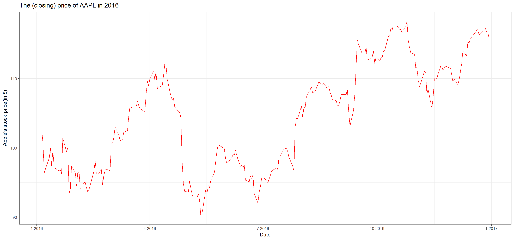

```{r setup, include=FALSE}
knitr::opts_chunk$set(echo = TRUE)
```
```{r}
suppressPackageStartupMessages(library(tidyverse))

#Read Apple's and Amazon.com's historical stock data
aapl_data <- read_csv("aapl.csv")
amzn_data <- read_csv("amzn.csv")

#Read cumulative returns data
cum_rets <- read_csv("cum_rets_gathered.csv")

```

I investigated the stock price and cumulative return changes for Apple and Amazon.com. I downloaded two datasets from `google finance` in `00_download-data.R`. I provided two figures on the price performance of each stock in `01_calculate_ret.R`.   
Each stock has different absolute value, so it is meaningless to compare them directly.  
  
## Apple's price performance in 2016   
This is the price performance of Apple's stock. The stock price decreased dramatically in May and June but it recovered later.  
  
### Plot

  
### Summary statistics
```{r}
summary(aapl_data$Close)
```


## Amazon's price performance in 2016
This is the price performance of Amazon's stock. The price decreased slightly in the beginning of the year 2016 but had an increasing tendency until October. Then, the price decreased slightly and fluctuated.  
  
### Plot


### Summary statistics
```{r}
summary(amzn_data$Close)
```
  
  
## Cumulative returns on both stocks
To compare two stocks' performance, I calculated the cumulative returns throughout the year, 2016. Cumulative return indicates the dollar amount you will get when you sell the stock given you invest \$1 in the beginning of the year. In January, the cumulative returns are similar. From February, Apple's stock returns more than Amazon's until the end of April. After then, Amazon's stock returns outperform Apple's. Thus, given \$1 invested, investor on Amazon's stock will get higher return anytime from May to the end of the year.   

### Plot


### Summary statistics
```{r}
cum_rets %>%
  group_by(Firm) %>%
  summarize_each(funs(mean, min, median, max), cum_ret) %>% 
  knitr::kable()

```

