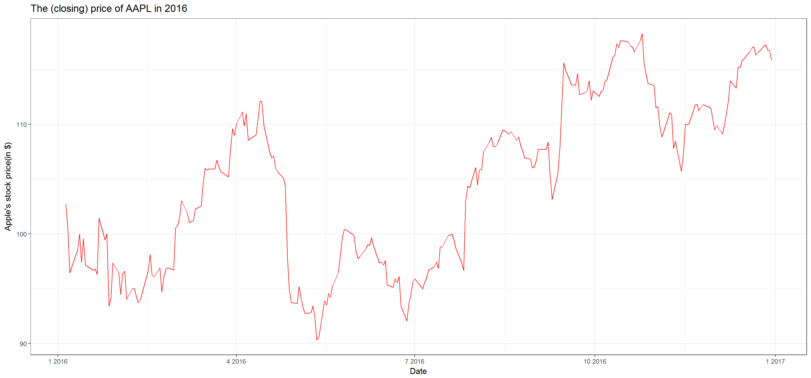
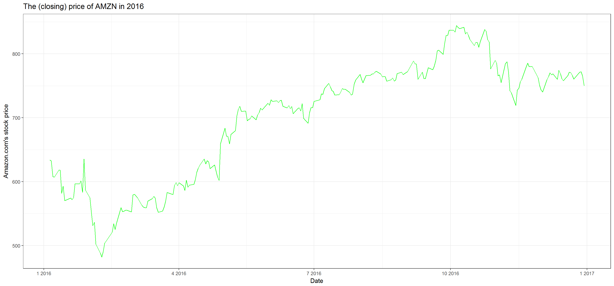
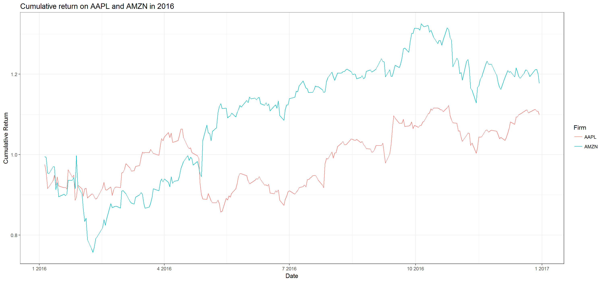
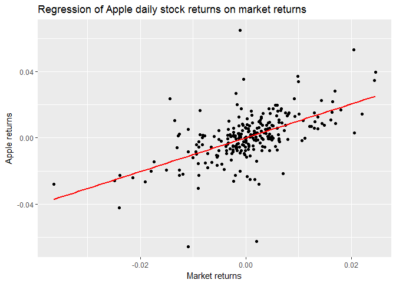
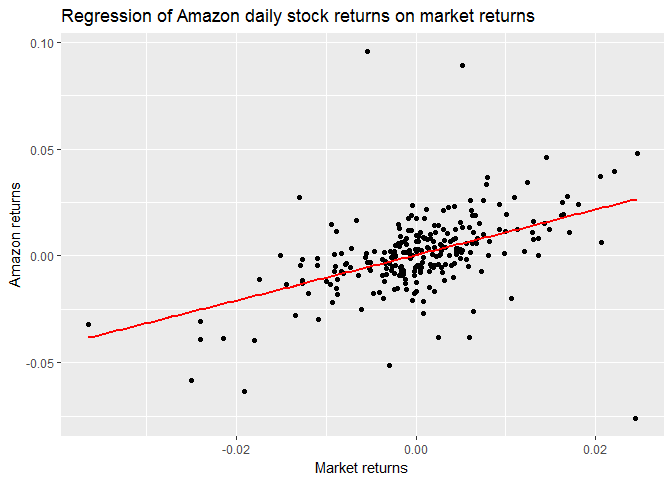

# 03_report


# The stock performances of Apple and Amazon.com
I investigated the stock price and cumulative return changes for Apple and Amazon.com. I downloaded two datasets from `google finance` in `00_download-data.R`. I provided two figures on the price performance of each stock in `01_calculate_ret.R`.   
Each stock has different absolute value, so it is meaningless to compare them directly.  


```r
suppressPackageStartupMessages(library(tidyverse))

#Read Apple's and Amazon.com's historical stock data
aapl_data <- read_csv("aapl.csv")
```

```
## Parsed with column specification:
## cols(
##   Date = col_character(),
##   Open = col_double(),
##   High = col_double(),
##   Low = col_double(),
##   Close = col_double(),
##   Volume = col_integer()
## )
```

```r
amzn_data <- read_csv("amzn.csv")
```

```
## Parsed with column specification:
## cols(
##   Date = col_character(),
##   Open = col_double(),
##   High = col_double(),
##   Low = col_double(),
##   Close = col_double(),
##   Volume = col_integer()
## )
```

```r
#Read cumulative returns data
cum_rets_d <- read_csv("cum_rets.csv")
```

```
## Parsed with column specification:
## cols(
##   Date = col_date(format = ""),
##   ret_cum_aapl = col_double(),
##   ret_cum_amzn = col_double(),
##   ret_aapl = col_double(),
##   ret_amzn = col_double()
## )
```

```r
cum_rets <- read_csv("cum_rets_gathered.csv")
```

```
## Parsed with column specification:
## cols(
##   Date = col_date(format = ""),
##   Firm = col_character(),
##   cum_ret = col_double()
## )
```


  
## Apple's price performance in 2016   
This is the price performance of Apple's stock. The stock price decreased dramatically in May and June but it recovered later.  
  
### Plot

  
### Summary statistics

```r
summary(aapl_data$Close)
```

```
##    Min. 1st Qu.  Median    Mean 3rd Qu.    Max. 
##   90.34   97.14  105.75  104.60  110.98  118.25
```


## Amazon's price performance in 2016
This is the price performance of Amazon's stock. The price decreased slightly in the beginning of the year 2016 but had an increasing tendency until October. Then, the price decreased slightly and fluctuated.  
  
### Plot


### Summary statistics

```r
summary(amzn_data$Close)
```

```
##    Min. 1st Qu.  Median    Mean 3rd Qu.    Max. 
##   482.1   606.9   727.9   699.5   767.9   844.4
```
  
  
## Cumulative returns on both stocks
To compare two stocks' performance, I calculated the cumulative returns throughout the year, 2016 (in `01_calculate-ret.R`). Cumulative return indicates the dollar amount you will get when you sell the stock given you invest \$1 in the beginning of the year. In January, the cumulative returns are similar. From February, Apple's stock returns more than Amazon's until the end of April. After then, Amazon's stock returns outperform Apple's. Thus, given \$1 invested, investor on Amazon's stock will get higher return anytime from May to the end of the year.   

### Plot
The plot is from `02_cum_ret_plot.R`.  



### Summary statistics
On average, Amazon.com has higher cumulative returns throughout the year. However, the `range` and standard deviation are smaller in the Apple's stock, which means the cumulative returns are less volatile. Given a investor has $1 investment on a stock in the beginning of the year and is forced to sell his/her stock at a random point in the year, some investors will choose to invest on Apple's stock (even though its mean cumulative return is lower than Amazon's). This is because the cumulative return of Apple's stock is less volatile (less uncertain). This depends on the risk averseness of the investors.

```r
cum_rets %>%
  group_by(Firm) %>%
  summarize_each(funs(mean, sd, min, median, max), cum_ret) %>% 
  knitr::kable(format = "markdown")
```

```
## `summarise_each()` is deprecated.
## Use `summarise_all()`, `summarise_at()` or `summarise_if()` instead.
## To map `funs` over a selection of variables, use `summarise_at()`
```


|Firm | cum_ret_mean| cum_ret_sd| cum_ret_min| cum_ret_median| cum_ret_max|
|:----|------------:|----------:|-----------:|--------------:|-----------:|
|AAPL |    0.9928907|  0.0726708|   0.8575225|       1.004177|    1.122449|
|AMZN |    1.0985608|  0.1451545|   0.7567937|       1.143032|    1.325547|

## Returns on market index
I followed the previous steps to calculate the daily returns and cumulative returns for SPDR S&P 500 ETF Trust(NYSEARCA:SPY) as a proxy for market returns. This is to see each firm's beta (sensitivity on market return; I assumed that **the risk free rate is equal to zero**). Beta is the slope coefficient when we regress individual firm's daily returns on market returns.

Follow the steps to calculate daily returns

```r
#Download historical prices from Jan-01-2016 to Dec-31-2016 (from google finance) 
download.file("http://finance.google.com/finance/historical?cid=700145&startdate=Jan+1%2C+2016&enddate=Dec+31%2C+2016&num=30&ei=cPwNWpDfJMep2Aab35ugCg&output=csv", destfile = "mkt.csv")
mkt_data <- read_csv("mkt.csv")
```

```
## Parsed with column specification:
## cols(
##   Date = col_character(),
##   Open = col_double(),
##   High = col_double(),
##   Low = col_double(),
##   Close = col_double(),
##   Volume = col_integer()
## )
```

```r
#Function to convert %b into %m
month_convert <- function(x){
  mon <- data.frame(b= c("Jan", "Feb", "Mar", "Apr", "May", "Jun", "Jul", "Aug", "Sep", "Oct", "Nov", "Dec"),
                    m= c("01", "02", "03", "04", "05", "06", "07", "08", "09", "10", "11", "12"))
    for (i in 1:nrow(mon))
      x <- gsub(mon[i, "b"], mon[i, "m"], x)
    return (x)
}

#Converting the strings to dates format (Date)
mkt_data$Date <- month_convert(mkt_data$Date)
mkt_data$Date <- as.Date(mkt_data$Date, format = "%d-%m-%y")


# Function for calculating daily returns and cumulative returns
ret_func <- function(x){
  x %>% 
    select(Date, Close, Volume) %>% 
    rename(prc = Close, vol = Volume) %>% 
    arrange(Date) %>% 
    mutate(ret = (prc/lag(prc,1))-1) %>% 
    filter(!is.na(ret)) %>% 
    mutate(ret_cum = cumprod(ret+1))
}

# Calculating daily returns and cumulative returns
mkt_ret <- ret_func(mkt_data)


# Merging data to compare daily returns
ret_d <- cum_rets_d %>% 
  inner_join(mkt_ret, by= "Date") %>% 
  select(Date, ret_aapl, ret_amzn, ret_mkt = ret)
```
  
Now, data for regression is ready. Beta is extracted by slope coefficients. I assumed that risk free rate is zero.

```r
### Apple's stock
#Beta is slope coefficient
summary(lm(ret_aapl ~ ret_mkt, ret_d))
```

```
## 
## Call:
## lm(formula = ret_aapl ~ ret_mkt, data = ret_d)
## 
## Residuals:
##       Min        1Q    Median        3Q       Max 
## -0.064696 -0.005684 -0.000286  0.005305  0.066025 
## 
## Coefficients:
##              Estimate Std. Error t value Pr(>|t|)    
## (Intercept) 2.028e-05  7.671e-04   0.026    0.979    
## ret_mkt     1.019e+00  9.289e-02  10.973   <2e-16 ***
## ---
## Signif. codes:  0 '***' 0.001 '**' 0.01 '*' 0.05 '.' 0.1 ' ' 1
## 
## Residual standard error: 0.01213 on 249 degrees of freedom
## Multiple R-squared:  0.326,	Adjusted R-squared:  0.3232 
## F-statistic: 120.4 on 1 and 249 DF,  p-value: < 2.2e-16
```

```r
#Plot
ret_d %>% 
	ggplot(aes(x=ret_mkt, y=ret_aapl)) +
	geom_point() +
	geom_smooth(method= "lm", se= FALSE, color = "red") +
	labs(x= "Market returns",
			 y= "Apple returns",
			 title = "Regression of Apple daily stock returns on market returns")
```

<!-- -->

```r
### Amazon's stock
#Beta is slope coefficient
summary(lm(ret_amzn ~ ret_mkt, ret_d))
```

```
## 
## Call:
## lm(formula = ret_amzn ~ ret_mkt, data = ret_d)
## 
## Residuals:
##       Min        1Q    Median        3Q       Max 
## -0.102367 -0.006865  0.000381  0.006911  0.101077 
## 
## Coefficients:
##              Estimate Std. Error t value Pr(>|t|)    
## (Intercept) 0.0003316  0.0010227   0.324    0.746    
## ret_mkt     1.0639326  0.1238347   8.592 9.56e-16 ***
## ---
## Signif. codes:  0 '***' 0.001 '**' 0.01 '*' 0.05 '.' 0.1 ' ' 1
## 
## Residual standard error: 0.01618 on 249 degrees of freedom
## Multiple R-squared:  0.2287,	Adjusted R-squared:  0.2256 
## F-statistic: 73.81 on 1 and 249 DF,  p-value: 9.556e-16
```

```r
#Plot
ret_d %>% 
	ggplot(aes(x=ret_mkt, y=ret_amzn)) +
	geom_point() +
	geom_smooth(method= "lm", se= FALSE, color = "red") +
	labs(x= "Market returns",
			 y= "Amazon returns",
			 title = "Regression of Amazon daily stock returns on market returns")
```

<!-- -->
The results shows that Apple stock's beta is estimated to be 1.019 and is statistically significant. The intercept coefficient is not statistically significant. This corresponds to the assumption that risk free rate is zero. 
The estimated slope coefficient on Amazon stock has quite similar patterns. The estimated value is 1.064 and is statistically significant. Intercept coefficient is not significant.  
Beta is a measure of the volatility, or systematic risk, of a security in comparison to the market as a whole. The reason why two stocks have values close to 1 is that those are two big stocks comprising of the market returns. Thus, those security's price moves with the market. 


