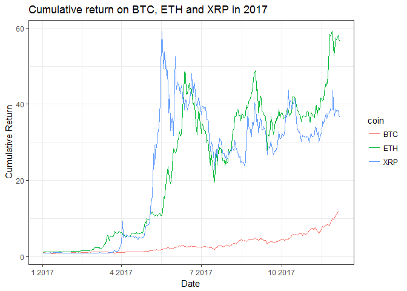
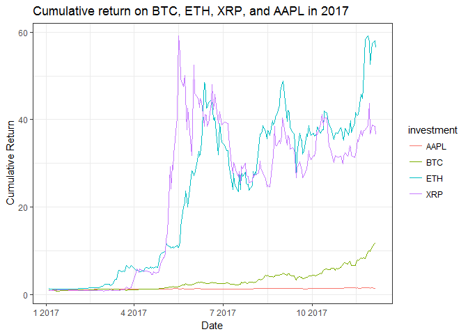

# STAT547M-hw10-An-Byeongchan


## Overview
I explore `Alpha Vantage API` which has realtime and historical data on stocks, physical currencies, and digital/crypto currencies.
   
In this hw10, I will follow the data analysis I did in hw07 ([link to hw07 03_report.md](../hw07/03_report.md)). I calculated the stock performances of Apple and Amazon.com in 2016 in hw07. I provided cumulative return on AAPL (Apple) and AMZN (Amazon.com) in 2016. Cumulative returns are buy-and-hold returns which show the cumulative return at a specific point when a unit amount ($1) is invested in the beginning of the period.
  
In this hw10, I will have look at digital and crypto currencies such as BTC(Bitcoin), ETH(Ethereum), XRP(Ripples) as the datasets are availalbe on `Alpha Vantage API`. In addition, I will compare these with Apple's stock performance (cumulative return).
  

## Stock performance (Apple)
`Alpha Vantage API` provides a variety of stock time series data: Intraday, Daily (adjusted), Weekly (adjusted), and Monthly (adjusted). I made a function which can extract daily adjusted dataset and monthly adjusted dataset. 

- `stock_data(symbol = symbol, interval = interval, outputsize = outputsize)`. 
    - Symbol is each firm's ticker symbol. 
    - interval is either "MONTHLY" or "DAILY" (They should be UPPER CASE!!)
    - outputsize has two values 'full' and 'compact': 'compact' returns only the latest 100 data points; 'full' returns the full-length time series of up to 20 years of historical data. 
Those datasets have open, high, low, and close prices, volume, and dividend amount. `Adjusted price` is adjusting for dividend payments.

```r
#install.packages("httr")
library(httr)
```

```
## Warning: package 'httr' was built under R version 3.4.3
```

```r
library(jsonlite)
library(purrr)
```

```
## 
## Attaching package: 'purrr'
```

```
## The following object is masked from 'package:jsonlite':
## 
##     flatten
```

```r
library(glue)
library(tidyverse)
```

```
## Warning: package 'tidyverse' was built under R version 3.4.2
```

```
## Loading tidyverse: ggplot2
## Loading tidyverse: tibble
## Loading tidyverse: tidyr
## Loading tidyverse: readr
## Loading tidyverse: dplyr
```

```
## Conflicts with tidy packages ----------------------------------------------
```

```
## collapse(): dplyr, glue
## filter():   dplyr, stats
## lag():      dplyr, stats
```

```r
#test <- GET("https://www.alphavantage.co/query?function=TIME_SERIES_MONTHLY_ADJUSTED&symbol=AAPL&apikey=RON9A5RW8SKDN593")
#test2 <- fromJSON("https://www.alphavantage.co/query?function=TIME_SERIES_MONTHLY_ADJUSTED&symbol=AAPL&apikey=RON9A5RW8SKDN593")


#stock_data to get the stock data (monthly or daily data)
# (Monthly or Daily) Adjusted Prices and Volumes
# symbol: Ticker symbol
# interval: 'MONTHLY' or 'DAILY' (MUST BE UPPER CASE!!!)
# outputsize: 'full' or 'compact' ('compact' prints recent 100 observations)
stock_data <- function(symbol = symbol, interval = interval, outputsize = outputsize){
	my_url <- glue('https://www.alphavantage.co/query?function=TIME_SERIES_{interval}_ADJUSTED&symbol={symbol}&outputsize={outputsize}&apikey=RON9A5RW8SKDN593')
	
	stock_dt <- fromJSON(my_url)
	if (interval == "MONTHLY") stock_dt2 <- stock_dt[["Monthly Adjusted Time Series"]]
	else if (interval == "DAILY") stock_dt2 <- stock_dt[["Time Series (Daily)"]]
	else stop('interval only takes 2 strings: "MONTHLY" or "DAILY"')
	
	stock_dt3 <- map_df(stock_dt2,`[`, c("1. open",
																			 "2. high",
																			 "3. low",
																			 "4. close",
																			 "5. adjusted close",
																			 "6. volume",
																			 "7. dividend amount"))
	stock_dt3 <- lapply(stock_dt3, function(x) as.numeric(x)) %>% 
		as.data.frame()
	stock_dt3['date'] <- names(stock_dt2)
	stock_dt3['symbol'] <- symbol
	stock_dt3$date <- as.Date(stock_dt3$date, format = "%Y-%m-%d")

	stock_dt3 <- stock_dt3 %>%
		select(symbol, date,
					 X5..adjusted.close, X6..volume) %>%
		rename(prc = X5..adjusted.close,
					 volume = X6..volume)

	return(stock_dt3)
}
```
I extracted Apple's stock data (from Jan 1 2017 to Dec 5 2017)

```r
AAPL <- stock_data(symbol = "AAPL", interval = "DAILY", outputsize = 'full') %>%
	filter(date>="2017-01-01" & date <= "2017-12-05" )

knitr::kable(head(AAPL), format = "markdown")
```


|symbol |date       |    prc|   volume|
|:------|:----------|------:|--------:|
|AAPL   |2017-12-05 | 169.64| 27008428|
|AAPL   |2017-12-04 | 169.80| 32115052|
|AAPL   |2017-12-01 | 171.05| 39590080|
|AAPL   |2017-11-30 | 171.85| 41484363|
|AAPL   |2017-11-29 | 169.48| 41456722|
|AAPL   |2017-11-28 | 173.07| 25468442|
  
  
## Digital and crypto currencies performance (BTC(Bitcoin), ETH(Ethereum), XRP(Ripples))
`Alpha Vantage API` also provides Digital and crypto currencies data. I made a function which can extract those data.  
- `digi_cur(symbol = symbol)`. 
    - Symbol is each currency's symbol. (eg. BTC(Bitcoin), ETH(Ethereum), XRP(Ripples))
This dataset has open, high, low, and close prices, volume, and market cap(price*volume). 


```r
# digi_cur to get the daily data for digital and crypto currencies such as Bitcoin)
#Daily prices and volumes for Digital Currency

# symbol: The digital/crypto currency of your choice such as BTC(Bitcoin), ETH(Ethereum), XRP(Ripples)
# outputsize: 'full' or 'compact' ('compact' prints recent 100 observations)
digi_cur <- function(symbol = symbol){
	my_url <- glue('https://www.alphavantage.co/query?function=DIGITAL_CURRENCY_DAILY&symbol={symbol}&market=USD&apikey=RON9A5RW8SKDN593')
	
	digi_curr <- fromJSON(my_url)
  digi_curr2 <- digi_curr[["Time Series (Digital Currency Daily)"]]

	digi_curr3 <- map_df(digi_curr2,`[`, c("1a. open (USD)", "1b. open (USD)",
																				 "2a. high (USD)", "2b. high (USD)",
																			   "3a. low (USD)", "3b. low (USD)",
																				 "4a. close (USD)", "4b. close (USD)",
																				 "5. volume",
																				 "6. market cap (USD)"))
	digi_curr3 <- lapply(digi_curr3, function(x) as.numeric(x)) %>% 
		as.data.frame()
	digi_curr3['date'] <- names(digi_curr2)
	digi_curr3['symbol'] <- symbol
	digi_curr3$date <- as.Date(digi_curr3$date, format = "%Y-%m-%d")

	digi_curr3 <- digi_curr3 %>%
		select(symbol, date,
					 X4a..close..USD., X5..volume, X6..market.cap..USD.) %>%
		rename(prc = X4a..close..USD.,
					 volume = X5..volume,
					 mktcap = X6..market.cap..USD.)

	return(digi_curr3)
}


# Get BTC(Bitcoin), ETH(Ethereum), XRP(Ripples) data
# I will choose the data from Jan 1 to Dec 5
btc <- digi_cur('btc') %>% filter(date >= "2017-01-01" & date <= "2017-12-05")
eth <- digi_cur('eth') %>% filter(date >= "2017-01-01" & date <= "2017-12-05")
xrp <- digi_cur('xrp') %>% filter(date >= "2017-01-01" & date <= "2017-12-05")
knitr::kable(tail(eth), format = "markdown")
```


|    |symbol |date       |       prc|   volume|  mktcap|
|:---|:------|:----------|---------:|--------:|-------:|
|334 |eth    |2017-01-06 | 10.058127| 346575.8| 3485904|
|335 |eth    |2017-01-05 | 10.152173| 901449.2| 9151669|
|336 |eth    |2017-01-04 | 11.002356| 717888.4| 7898463|
|337 |eth    |2017-01-03 |  9.531111| 648583.1| 6181717|
|338 |eth    |2017-01-02 |  8.232979| 266461.0| 2193768|
|339 |eth    |2017-01-01 |  8.036445| 294315.4| 2365250|
  
I extracted each currency's data (from Jan 1 2017 to Dec 5 2017). I made a function to calculate daily returns and cumulative returns. The tail of `cum_ret_coins` shows their cumulative returns on December when they invested unit amount ($1) on Jan 1 2017.The result is quite amazing! Given that you invested 1 dollar in each currency (Jan 1 2017), you will get 11.8 in Bitcoin, 56.5 in Ethereum, 36.5 in Ripples (Dec 5 2017)!! I haven't tried to invest on those currencies so I am not sure they are liquid enough to exchange for USD whenver you want. However, those returns are astonishing!

```r
# Function for calculating daily returns and cumulative returns
ret_func <- function(x){
  x %>% 
    arrange(date) %>% 
    mutate(ret = (prc/lag(prc,1))-1) %>% 
    filter(!is.na(ret)) %>% 
    mutate(ret_cum = cumprod(ret+1))
}

# Calculating daily returns and cumulative returns for those currencies
btc_ret <- ret_func(btc) 
eth_ret <- ret_func(eth)
xrp_ret <- ret_func(xrp)

# Merging three data-sets to compare cumulative returns between currencies
cum_ret_coins <- btc_ret %>% 
  inner_join(eth_ret, by= "date") %>%
	inner_join(xrp_ret, by= "date") %>% 
  select(date, ret_cum.x, ret_cum.y, ret_cum, 
  			 ret.x, ret.y, ret) %>%
  rename(ret_cum_btc= ret_cum.x, ret_cum_eth= ret_cum.y, ret_cum_xrp= ret_cum,
  			 ret_btc = ret.x, ret_eth = ret.y, ret_xrp = ret)
knitr::kable(head(cum_ret_coins), format = "markdown")
```


|date       | ret_cum_btc| ret_cum_eth| ret_cum_xrp|    ret_btc|    ret_eth|    ret_xrp|
|:----------|-----------:|-----------:|-----------:|----------:|----------:|----------:|
|2017-01-02 |   1.0251096|    1.024455|   0.9888029|  0.0251096|  0.0244553| -0.0111971|
|2017-01-03 |   1.0387343|    1.185986|   1.0080907|  0.0132909|  0.1576746|  0.0195062|
|2017-01-04 |   1.1460766|    1.369058|   0.9995086|  0.1033395|  0.1543624| -0.0085132|
|2017-01-05 |   1.0094980|    1.263267|   0.9647594| -0.1191706| -0.0772727| -0.0347663|
|2017-01-06 |   0.9020805|    1.251564|   0.9803821| -0.1064068| -0.0092637|  0.0161933|
|2017-01-07 |   0.9093245|    1.196879|   0.9844211|  0.0080303| -0.0436936|  0.0041199|

```r
knitr::kable(tail(cum_ret_coins), format = "markdown")
```


|    |date       | ret_cum_btc| ret_cum_eth| ret_cum_xrp|   ret_btc|    ret_eth|    ret_xrp|
|:---|:----------|-----------:|-----------:|-----------:|---------:|----------:|----------:|
|333 |2017-11-30 |    10.13816|    54.31039|    37.21769| 0.0249583|  0.0315588|  0.0132779|
|334 |2017-12-01 |    11.03517|    57.47486|    38.77354| 0.0884794|  0.0582663|  0.0418040|
|335 |2017-12-02 |    11.04725|    56.98309|    38.20959| 0.0010947| -0.0085562| -0.0145448|
|336 |2017-12-03 |    11.37590|    57.53036|    38.37200| 0.0297495|  0.0096041|  0.0042505|
|337 |2017-12-04 |    11.75266|    58.04354|    38.53800| 0.0331189|  0.0089202|  0.0043262|
|338 |2017-12-05 |    11.80862|    56.52110|    36.52420| 0.0047613| -0.0262293| -0.0522549|
  
  
I plotted each currency's performance (cumulative returns). This shows the cumulative (buy-and-hold) return when you invested unit amount ($1) Jan 1 2017. The plot shows that even cumulative returns are really volatile especially in Ethereum and Ripples. Bitcoin has relatively stable cumulative returns compared to the others. 

```r
# Preparing data for plotting together
cum_ret_coins2 <- cum_ret_coins %>% 
	select(date, ret_cum_btc, ret_cum_eth, ret_cum_xrp) %>% 
  rename(BTC = ret_cum_btc, ETH = ret_cum_eth, XRP = ret_cum_xrp) %>% 
  gather(key ="coin", value = "cum_ret", BTC, ETH, XRP)


#Plot the cumulative returns
cum_ret_coins2 %>% 
  ggplot(aes(x= date, y= cum_ret, color= coin)) +
  geom_line() +
  theme_bw() +
  labs(x="Date",
       y="Cumulative Return",
       title = "Cumulative return on BTC, ETH and XRP in 2017")
```

<!-- -->

I will compared those currencies' performance with Apple's stock performance. Those currencies are traded every day including week-ends so observations are 339 for each currency. However, stocks are not traded on week-ends and holidays so the number of observations in AAPL is 215. I matched the date on Apple's trading dates. The plot shows that even relatively low performance of Bitcoin has much higher returns compared to Apple's stock.

```r
# Calculating daily returns and cumulative returns for Apple stock as reference
AAPL_ret <- ret_func(AAPL)

# Merging four data-sets to compare cumulative returns between currencies and the stock
cum_ret_mixed <- cum_ret_coins %>% 
	inner_join(AAPL_ret, by = "date") %>% 
  select(date, ret_cum_btc, ret_cum_eth, ret_cum_xrp, ret_cum,
  			 ret_btc, ret_eth, ret_xrp, ret) %>%
  rename(ret_cum_AAPL = ret_cum, ret_AAPL = ret)

# Preparing data for plotting together
cum_ret_mixed2 <- cum_ret_mixed %>% 
	select(date, ret_cum_btc, ret_cum_eth, ret_cum_xrp, ret_cum_AAPL) %>% 
  rename(BTC = ret_cum_btc, ETH = ret_cum_eth, XRP = ret_cum_xrp, 
  			 AAPL = ret_cum_AAPL) %>% 
  gather(key ="investment", value = "cum_ret", BTC, ETH, XRP, AAPL)


#Plot the cumulative returns
cum_ret_mixed2 %>% 
  ggplot(aes(x= date, y= cum_ret, color= investment)) +
  geom_line() +
  theme_bw() +
  labs(x="Date",
       y="Cumulative Return",
       title = "Cumulative return on BTC, ETH, XRP, and AAPL in 2017")
```

<!-- -->


