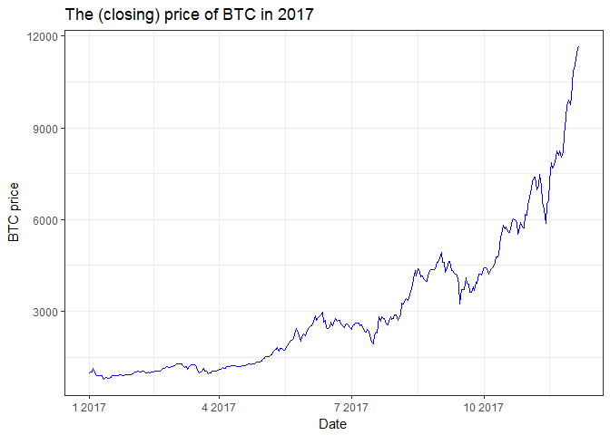

# STAT547M-hw06-An-Byeongchan


I explore `Alpha Vantage API` which has realtime and historical data on stocks, physical currencies, and digital/crypto currencies.


```r
#install.packages("httr")
library(httr)
```

```
## Warning: package 'httr' was built under R version 3.4.3
```

```r
library(jsonlite)
library(purrr)
```

```
## 
## Attaching package: 'purrr'
```

```
## The following object is masked from 'package:jsonlite':
## 
##     flatten
```

```r
library(glue)
library(tidyverse)
```

```
## Warning: package 'tidyverse' was built under R version 3.4.2
```

```
## Loading tidyverse: ggplot2
## Loading tidyverse: tibble
## Loading tidyverse: tidyr
## Loading tidyverse: readr
## Loading tidyverse: dplyr
```

```
## Conflicts with tidy packages ----------------------------------------------
```

```
## collapse(): dplyr, glue
## filter():   dplyr, stats
## lag():      dplyr, stats
```

```r
#test <- GET("https://www.alphavantage.co/query?function=TIME_SERIES_MONTHLY_ADJUSTED&symbol=AAPL&apikey=RON9A5RW8SKDN593")

#test2 <- fromJSON("https://www.alphavantage.co/query?function=TIME_SERIES_MONTHLY_ADJUSTED&symbol=AAPL&apikey=RON9A5RW8SKDN593")


#stock_data to get the stock data (monthly or daily data)
# (Monthly or Daily) Adjusted Prices and Volumes

# symbol: Ticker symbol
# interval: 'MONTHLY' or 'DAILY' (MUST BE UPPER CASE!!!)
# outputsize: 'full' or 'compact' ('compact' prints recent 100 observations)
stock_data <- function(symbol = symbol, interval = interval, outputsize = outputsize){
	my_url <- glue('https://www.alphavantage.co/query?function=TIME_SERIES_{interval}_ADJUSTED&symbol={symbol}&outputsize={outputsize}&apikey=RON9A5RW8SKDN593')
	
	stock_dt <- fromJSON(my_url)
	if (interval == "MONTHLY") stock_dt2 <- stock_dt[["Monthly Adjusted Time Series"]]
	else if (interval == "DAILY") stock_dt2 <- stock_dt[["Time Series (Daily)"]]
	else stop('interval only takes 2 strings: "MONTHLY" or "DAILY"')
	
	stock_dt3 <- map_df(stock_dt2,`[`, c("1. open",
																			 "2. high",
																			 "3. low",
																			 "4. close",
																			 "5. adjusted close",
																			 "6. volume",
																			 "7. dividend amount"))
	stock_dt3 <- lapply(stock_dt3, function(x) as.numeric(x)) %>% 
		as.data.frame()
	stock_dt3['date'] <- names(stock_dt2)
	stock_dt3['symbol'] <- symbol
	stock_dt3$date <- as.Date(stock_dt3$date, format = "%Y-%m-%d")

	stock_dt3 <- stock_dt3 %>%
		select(symbol, date,
					 X5..adjusted.close, X6..volume) %>%
		rename(prc = X5..adjusted.close,
					 volume = X6..volume)

	return(stock_dt3)
}
	
AAPL <- stock_data(symbol = "AAPL", interval = "MONTHLY", outputsize = 'compact')
head(AAPL)
```

```
##   symbol       date      prc    volume
## 1   AAPL 2017-12-08 169.9695 163473954
## 2   AAPL 2017-11-30 171.8500 583856889
## 3   AAPL 2017-10-31 168.4325 496135305
## 4   AAPL 2017-09-29 153.5661 669594016
## 5   AAPL 2017-08-31 163.4106 638221161
## 6   AAPL 2017-07-31 147.5968 411377229
```


```r
# digi_cur to get the daily data for digital and crypto currencies such as Bitcoin)
#Daily prices and volumes for Digital Currency

# symbol: The digital/crypto currency of your choice such as BTC(Bitcoin), ETH(Ethereum), XRP(Ripples)
# outputsize: 'full' or 'compact' ('compact' prints recent 100 observations)
digi_cur <- function(symbol = symbol){
	my_url <- glue('https://www.alphavantage.co/query?function=DIGITAL_CURRENCY_DAILY&symbol={symbol}&market=USD&apikey=RON9A5RW8SKDN593')
	
	digi_curr <- fromJSON(my_url)
  digi_curr2 <- digi_curr[["Time Series (Digital Currency Daily)"]]

	digi_curr3 <- map_df(digi_curr2,`[`, c("1a. open (USD)", "1b. open (USD)",
																				 "2a. high (USD)", "2b. high (USD)",
																			   "3a. low (USD)", "3b. low (USD)",
																				 "4a. close (USD)", "4b. close (USD)",
																				 "5. volume",
																				 "6. market cap (USD)"))
	digi_curr3 <- lapply(digi_curr3, function(x) as.numeric(x)) %>% 
		as.data.frame()
	digi_curr3['date'] <- names(digi_curr2)
	digi_curr3['symbol'] <- symbol
	digi_curr3$date <- as.Date(digi_curr3$date, format = "%Y-%m-%d")

	digi_curr3 <- digi_curr3 %>%
		select(symbol, date,
					 X4a..close..USD., X5..volume, X6..market.cap..USD.) %>%
		rename(prc = X4a..close..USD.,
					 volume = X5..volume,
					 mktcap = X6..market.cap..USD.)

	return(digi_curr3)
}


# Get BTC(Bitcoin), ETH(Ethereum), XRP(Ripples) data
# I will choose the data from Jan 1 to Dec 5
btc <- digi_cur('btc') %>% filter(date >= "2017-01-01" & date <= "2017-12-05")
eth <- digi_cur('eth') %>% filter(date >= "2017-01-01" & date <= "2017-12-05")
xrp <- digi_cur('xrp') %>% filter(date >= "2017-01-01" & date <= "2017-12-05")
tail(eth)
```

```
##     symbol       date       prc   volume  mktcap
## 334    eth 2017-01-06 10.058127 346575.8 3485904
## 335    eth 2017-01-05 10.152173 901449.2 9151669
## 336    eth 2017-01-04 11.002355 717888.4 7898463
## 337    eth 2017-01-03  9.531110 648583.1 6181717
## 338    eth 2017-01-02  8.232979 266461.0 2193768
## 339    eth 2017-01-01  8.036445 294315.4 2365250
```


```r
# Function for calculating daily returns and cumulative returns
ret_func <- function(x){
  x %>% 
    arrange(date) %>% 
    mutate(ret = (prc/lag(prc,1))-1) %>% 
    filter(!is.na(ret)) %>% 
    mutate(ret_cum = cumprod(ret+1))
}

# Calculating daily returns and cumulative returns for those currencies
btc_ret <- ret_func(btc) 
eth_ret <- ret_func(eth)
xrp_ret <- ret_func(xrp)

# Merging three data-sets to compare cumulative returns between currencies
cum_ret_coins <- btc_ret %>% 
  inner_join(eth_ret, by= "date") %>%
	inner_join(xrp_ret, by= "date") %>% 
  select(date, ret_cum.x, ret_cum.y, ret_cum, 
  			 ret.x, ret.y, ret) %>%
  rename(ret_cum_btc= ret_cum.x, ret_cum_eth= ret_cum.y, ret_cum_xrp= ret_cum,
  			 ret_btc = ret.x, ret_eth = ret.y, ret_xps = ret)
head(cum_ret_coins)
```

```
##         date ret_cum_btc ret_cum_eth ret_cum_xrp      ret_btc      ret_eth
## 1 2017-01-02   1.0251096    1.024455   0.9888029  0.025109613  0.024455324
## 2 2017-01-03   1.0387343    1.185986   1.0080907  0.013290921  0.157674623
## 3 2017-01-04   1.1460766    1.369058   0.9995086  0.103339511  0.154362391
## 4 2017-01-05   1.0094980    1.263267   0.9647594 -0.119170572 -0.077272730
## 5 2017-01-06   0.9020805    1.251564   0.9803821 -0.106406769 -0.009263682
## 6 2017-01-07   0.9093245    1.196879   0.9844211  0.008030259 -0.043693589
##        ret_xps
## 1 -0.011197060
## 2  0.019506150
## 3 -0.008513188
## 4 -0.034766312
## 5  0.016193340
## 6  0.004119903
```

```r
tail(cum_ret_coins)
```

```
##           date ret_cum_btc ret_cum_eth ret_cum_xrp     ret_btc
## 333 2017-11-30    10.13816    54.31039    37.21769 0.024958260
## 334 2017-12-01    11.03517    57.47486    38.77354 0.088479373
## 335 2017-12-02    11.04725    56.98309    38.20959 0.001094662
## 336 2017-12-03    11.37590    57.53036    38.37200 0.029749457
## 337 2017-12-04    11.75266    58.04354    38.53800 0.033118950
## 338 2017-12-05    11.80862    56.52110    36.52420 0.004761313
##          ret_eth      ret_xps
## 333  0.031558764  0.013277946
## 334  0.058266323  0.041803957
## 335 -0.008556240 -0.014544753
## 336  0.009604146  0.004250540
## 337  0.008920155  0.004326187
## 338 -0.026229275 -0.052254941
```

```r
# Preparing data for plotting together
cum_ret_coins2 <- cum_ret_coins %>% 
	select(date, ret_cum_btc, ret_cum_eth, ret_cum_xrp) %>% 
  rename(BTC = ret_cum_btc, ETH = ret_cum_eth, XRP = ret_cum_xrp) %>% 
  gather(key ="coin", value = "cum_ret", BTC, ETH, XRP)


#Plot the cumulative returns
cum_ret_coins2 %>% 
  ggplot(aes(x= date, y= cum_ret, color= coin)) +
  geom_line() +
  theme_bw() +
  labs(x="Date",
       y="Cumulative Return",
       title = "Cumulative return on BTC, ETH and XRP in 2016")
```

<!-- -->


